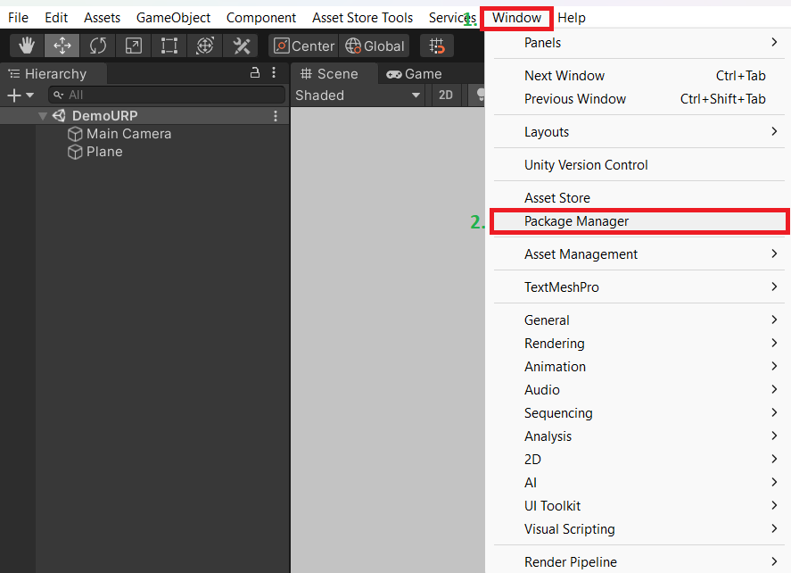
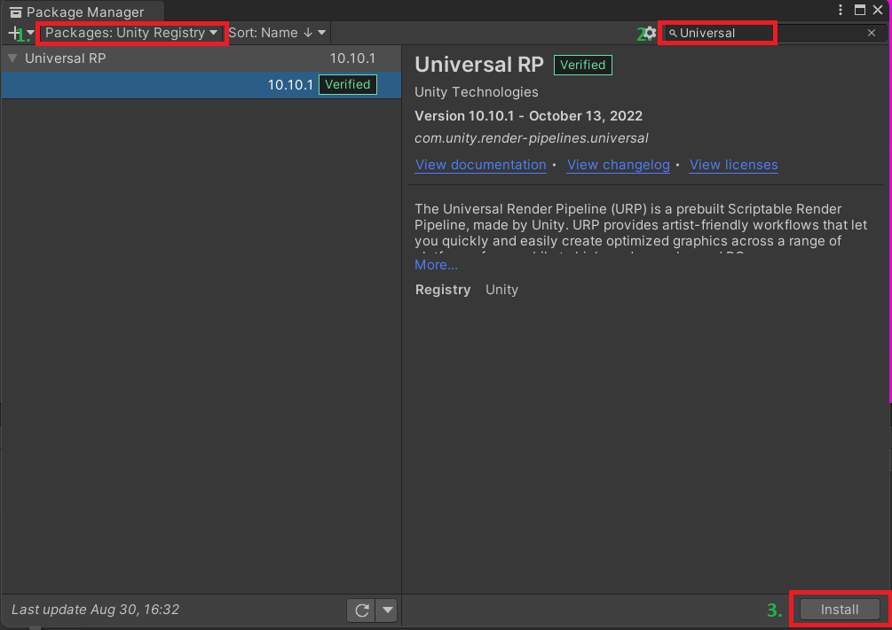
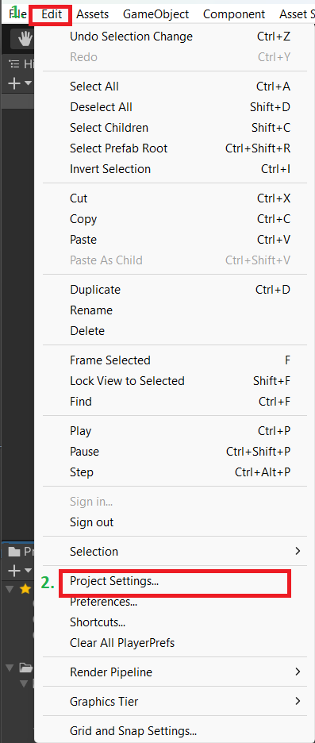
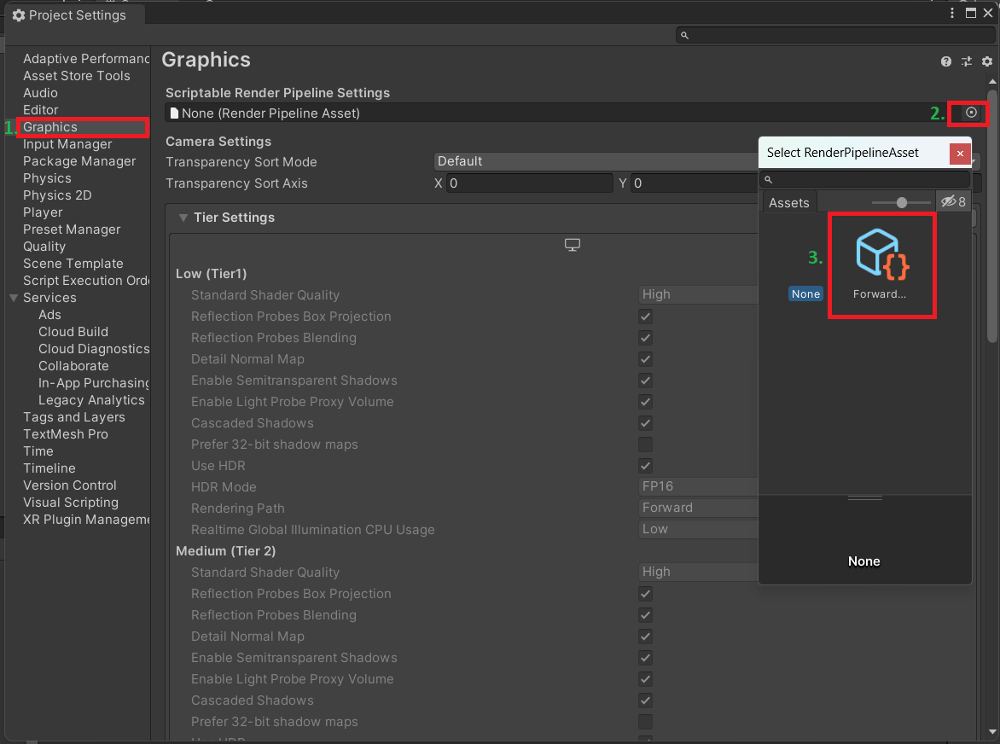

# Documentation Kuwahara Filter

## Installation Built-In

* Delete the script **`KuwaharaFilter/Scripts/AnisotropicKuwaharaEffectURP.cs`**
* Add the component **`KuwaharaFilter/Scripts/AnisotropicKuwaharaEffect.cs`** to the main camera

## Installation URP

* #### Install the Universal RP package if it's not already installed
    * Open Package Manager
        * Push button **`Window`**
        * Push button **`Package Manager`**

         

    * Install Universal Rendering Pipeline in the opened window
        * Select **`Unity Registry`** in **`Packages`** 
        * In the search section, enter **`Universal`**
        * Push button **`Install`**

         

* #### Select pipeline asset 
    * Open Project Settings
        * Push button **`Edit`**
        * Push button **`Project Settings`**

         

    * Select universal pipeline asset in the opened window
        * Select section **`Graphics`**
        * Select **`ForwardRenderingURP`** as shown in the screenshot below.

         

You can also check the installation instructions by following the link below
https://youtu.be/gQ9oDMeCQ7k?si=DEn87WKjBQp0NNWb